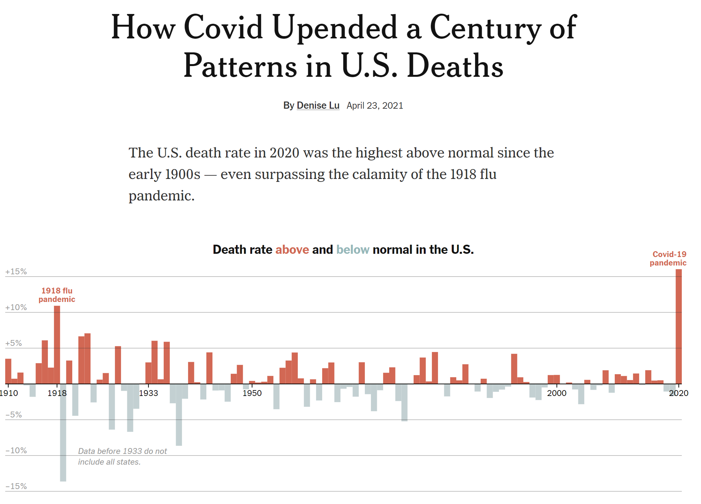

<center> *To see a version of this with the R code [echoed](https://en.wikipedia.org/wiki/Echo_(command)) click 
[here](https://covid19-explorer.org/1918/code.html).*</center>
<center> <h1>Did 2020 'surpass the calamity of the 1918 flu pandemic?'</h1> </center>
<center> <h2>Let's take a look</h2> </center>


<br>

On April 23rd, the *New York Times* published an interesting 
[analyis](https://www.nytimes.com/interactive/2021/04/23/us/covid-19-death-toll.html) purporting to show that the
global COVID-19 pandemic had 'upended a century of patterns' of death and resulted in a 'calamity [of excess mortality] 
surpassing the 1918' [Spanish flu pandemic](https://en.wikipedia.org/wiki/Spanish_flu).

This is a screenshot of the header & main figure supporting this claim.



As the Spanish flu pandemic is though to have killed 
[17-100 million people worldwide](https://en.wikipedia.org/wiki/Spanish_flu) at a time when the world's population
was about [one fourth its current size](https://www.worldometers.info/world-population/world-population-by-year/);
and since the current *global* death toll of COVID-19 is around [3.1 million](https://www.worldometers.info/coronavirus/),
this claim seemed a tiny bit far-fetched.

Let's unpack it.

## The data

The first thing we can do is download data for the U.S. 
[age-adjusted death rates through time](https://www.cdc.gov/nchs/data-visualization/mortality-trends/index.htm).

The age-adjusted death rate is just the mortality rate for a given population, adjusted to match the age-distribution
of another. Age-adjustment is a necessary [standardization method](https://www.ncbi.nlm.nih.gov/pmc/articles/PMC3406211/)
required to compare mortality rates through time or between populations with different demographic distributions. This is 
because mortality [increases with age](https://www.ssa.gov/oact/STATS/table4c6.html), and thus a population with a higher 
median age (like Japan, for instance) will tend to have a higher crude death rate, even if the rate for any *particular* 
age is lower overall! In the U.S., the CDC National Center for Health Statistics compiles this data which are age-adjusted 
to match the United States demographic distribution of the 2000 census.

Through 2018, age-adjusted mortality rates for the U.S. can be downloaded from the NCHS 
[here](https://www.cdc.gov/nchs/data-visualization/mortality-trends/index.htm). To add the 2019 and 2020 death rates we can
refer to this article in the CDC *Morbidity and Mortality Weekly Report* by Ahmad et al. 
([2001](http://dx.doi.org/10.15585/mmwr.mm7014e1)).

```{r, echo=FALSE}
## download & clean data, extracting all sexes, all races age-adjusted
## death rates for U.S. 1900-2018
X<-read.csv(file="https://data.cdc.gov/api/views/w9j2-ggv5/rows.csv?accessType=DOWNLOAD")
ii<-which(X[,2]=="All Races")
jj<-which(X[,3]=="Both Sexes")
X<-X[intersect(ii,jj),]
DD<-X[,"Age.adjusted.Death.Rate",drop=FALSE]
DD<-gsub(",","",DD[,1])
DeathRate<-setNames(as.numeric(DD),X[[1]])
## append 2019 & 2020 provisional death 
## rates from https://www.cdc.gov/mmwr/volumes/70/wr/mm7014e1.htm
DeathRate<-c(DeathRate,setNames(c(715.2,828.7),c(2019,2020)))
```

## Reiterating the *Times* analysis

My first challenge was to repeat the *New York Times* key analysis that was used to assert that 2020 was a more calamitous 
year of U.S. death than 1918.

Luckily, the report's author ([Denise Lu](http://deniselu.com/)) was kind enough to publish her methodology as follows:


So, in other words, for each five years she fit a trendline (*linear regression*) to the U.S. age-adjusted death rate, 
then she *predicted* the death rate for the 6th year. Next she simply calculated the difference between the observed and
predicted death rate as an *excess* in the rate for that year. Finally, she took the ratio of observed and predicted to 
compute the *proportional* excess in the age-adjusted mortality rate for each year. (1918 was *not* used to make predictions 
about other years, but no other special exceptions were made.)

That shouldn't be too hard to repeat. Let's try it! Here's my graph.

```{r fig.width=12, fig.height=6, units="in", dpi=300, echo=FALSE, fig.cap="Figure 1. Re-iteration of *New York Times* analysis by Denise Lu."}
## first, reproduce the figure of NYTimes article
## https://www.nytimes.com/interactive/2021/04/23/us/covid-19-death-toll.html
Normal<-setNames(rep(NA,116),1905:2020)
for(i in 1:116){
	x<-as.numeric(names(DeathRate)[i:(i+4)])
	y<-DeathRate[i:(i+4)]
	if(any(x==1918)){
		ii<-which(x==1918)
		x<-x[-ii]
		y<-y[-ii]
	}
	fit<-lm(y~x)
	Normal[i]<-predict(fit,newdata=data.frame(x=max(x)+1))
}
percentAbove<-(DeathRate[6:121]-Normal)/Normal*100
par(mar=c(5.1,4.1,2.1,1.1))
plot(NA,xlim=c(1900,2020),ylim=range(percentAbove),las=3,
	ylab="% above predicted",xlab="",
	bty="n")
grid()
for(i in 1:length(percentAbove))
	polygon(x=1904+i+c(-0.5,0.5,0.5,-0.5),
		y=c(0,0,percentAbove[i],percentAbove[i]),
		col=if(percentAbove[i]>0) palette()[2] else
		"lightgrey",border="transparent")
```

Now go ahead compare my Figure 1 to the plot copied from the *Times* article, above, & you should see that they match 
*exactly*. 

So far so good. Denise Lu and I are clearly using the same data. That's a good start.

## Problem 1: Proportional rather than absolute changes

My first qualm with the article is that in the *Times* analysis Lu elected to use proportional, rather than absolute, changes 
in mortality rate.

This is an important decision & I would argue that it is inconsistent with how we normally evaluate risk. For instance, in the 
event of a plane crash you are nearly 100% more likely to die if seated in an aisle seat in the front or middle of the aircraft
compared to a [middle seat near the back](https://www.businessinsider.com/how-to-survive-a-plane-crash-best-place-to-sit-2018-4).
Nonetheless, because the risk of dying overall is so low, seasoned air travellers not only don't try to avoid sitting in the
'least safe' seats of the aircraft (i.e., near the front), they pay good money for the privilege! By measuring proportional
changes in the death rate, and by treating them as equivalent, Lu has decided that a 10% increase in the risk of death is a
10% increase in the risk of death, regardless of whether that change increased your annualized probability of dying from 
0.7% to 0.77% (a change of 0.07%) or from 2% to 2.2% (a change that is nearly three times larger in absolute terms).

Let's re-do the *Times* analysis, but this time mapping *absolute* rather than *proportional* excesses in the death rate 
compared to predicted. Everything is the same as before in this analysis, but I no longer standardize by the predicted death
rate, so excesses (or deficits) are expressed in deaths / 100,000 population, rather than as a percent.

```{r fig.width=12, fig.height=6, units="in", dpi=300, echo=FALSE, fig.cap="Figure 2. Changes in the U.S. age-adjusted death rate through time: re-iterating the methodology of the *New York Times*, but showing absolute, rather than proportional, change."}
## now compute absolute, rather than proportional, deaths above predicted using
## the regression method of 
## https://www.nytimes.com/interactive/2021/04/23/us/covid-19-death-toll.html
Normal<-setNames(rep(NA,116),1905:2020)
for(i in 1:116){
	x<-as.numeric(names(DeathRate)[i:(i+4)])
	y<-DeathRate[i:(i+4)]
	if(any(x==1918)){
		ii<-which(x==1918)
		x<-x[-ii]
		y<-y[-ii]
	}
	fit<-lm(y~x)
	## cat(paste(names(Normal)[i],": ",coef(fit)[2],"\n",sep=""))
	Normal[i]<-predict(fit,newdata=data.frame(x=max(x)+1))
}
deathsAbove<-(DeathRate[6:121]-Normal)
par(mar=c(5.1,4.1,2.1,1.1))
plot(NA,xlim=c(1900,2020),ylim=range(deathsAbove),las=3,
	ylab="deaths / 100,000 population above predicted",xlab="",
	bty="n")
grid()
for(i in 1:length(deathsAbove))
	polygon(x=1904+i+c(-0.5,0.5,0.5,-0.5),
		y=c(0,0,deathsAbove[i],deathsAbove[i]),
		col=if(deathsAbove[i]>0) palette()[2] else
		"lightgrey",border="transparent")
```

In this analysis we still see a *very large* effect of the 2020 pandemic, but in terms of a real change in deaths / 100,000 
population, this effect is only about one-half the size of the excess associated with the 1918 Spanish flu pandemic.

## Problem 2: Ignoring the change in mean

My second qualm with the *Times* piece is a bit more philosophical, rather than methodological, and that is that it underplays the 
massive improvement in the death rate that we've seen over the past century. 

In the figure below, I have graphed the age-adjusted death rate / 100,000 population from 1900 to the present day. 

```{r fig.width=12, fig.height=6, units="in", dpi=300, echo=FALSE, fig.cap="Figure 3. United States age-adjusted death rate / 100,000 population through time from 1900-2020."}
## now just plot the age-adjusted death rate through time from 1900--
## 2020
par(mar=c(5.1,4.1,2.1,1.1))
plot(1900:2020,DeathRate,type="l",xlim=c(1900,2020),las=3,ylim=c(0,2600),
	ylab="age-adjusted death rate / 100,000 population",xlab="",
	bty="n",pch=21,bg="grey")
grid()
points(1900:2020,DeathRate,pch=21,bg="grey")
```

The reality, that we see here is that the 2020 uptick in mortality indeed temporarily erases huge progress in reduce the death 
rate -- but it nonetheless only increased the rate back to about its 2003/2004 level. This can be seen by simply drawing a 
horizontal line from the 2020 death rate backwards in time.

We can likewise overlay our mortality displacements, from Figure 2, onto the generally decreasing death rate through time. Once again,
we see that the death rate ticked up in 2020 by a large amount -- but that the overwhelming trend over the past 120 years has been 
towards a decreased death rate through time.

```{r fig.width=12, fig.height=6, units="in", dpi=300, echo=FALSE, fig.cap="Figure 4. United States age-adjusted death rate / 100,000 population through time. The observed death rate is indicated by grey (normal) and red (excess) bars. Fewer deaths than expected are indicated by white bars."}
## now use the regression method, but show both the observed death rate (grey+red)
## the predicted death rate (grey) and deaths below normal (white)
par(mar=c(5.1,4.1,2.1,1.1))
plot(NA,xlim=c(1900,2020),ylim=c(0,2800),las=3,
	ylab="age-adjusted deaths / 100,000 population",xlab="",
	bty="n")
grid()
for(i in 1:5){
	polygon(x=1899+i+c(-0.5,0.5,0.5,-0.5),
		y=c(0,0,DeathRate[i],DeathRate[i]),
		col="lightgrey",
		border="black")
}
for(i in 6:length(DeathRate)){
	x<-as.numeric(names(DeathRate)[(i-6):(i-1)])
	y<-DeathRate[(i-6):(i-1)]
	if(any(x==1918)){
		ii<-which(x==1918)
		x<-x[-ii]
		y<-y[-ii]
	}
	fit<-lm(y~x)
	Normal<-predict(fit,newdata=data.frame(x=1899+i))
	if(Normal<DeathRate[i]){
		polygon(x=1899+i+c(-0.5,0.5,0.5,-0.5),
			y=c(0,0,Normal,Normal),
			col="lightgrey",
			border="black")
		polygon(x=1899+i+c(-0.5,0.5,0.5,-0.5),
			y=c(Normal,Normal,DeathRate[i],DeathRate[i]),
			col=palette()[2],
			border="black")
	} else {
		polygon(x=1899+i+c(-0.5,0.5,0.5,-0.5),
			y=c(0,0,DeathRate[i],DeathRate[i]),
			col="lightgrey",
			border="black")
		polygon(x=1899+i+c(-0.5,0.5,0.5,-0.5),
			y=c(DeathRate[i],DeathRate[i],Normal,Normal),
			col="white",
			border="black")
	}
}
par(lend=1)
arrows(x0=1925,y0=DeathRate["1918"],x1=1919,y1=DeathRate["1918"],
	length=0.1,lwd=2,col=palette()[4])
text(x=1925,y=DeathRate["1918"],"Spanish flu pandemic (1918)",
	cex=0.8,pos=4)
arrows(x0=2020,y0=1300,x1=2020,y1=1.05*DeathRate["2020"],
	length=0.1,lwd=2,col=palette()[4])
text(x=2020,y=1300,"COVID-19\npandemic\n(2020)",pos=2,
	cex=0.8)
legend("topright",c("death rate / 100,000 population",
	"deaths above predicted",
	"deaths below predicted"),
	pch=22,pt.bg=c("lightgrey",palette()[2],"white"),
	pt.cex=1.5)
```

## Problem 3: Arbitrary definition of 'normal'

In this context, I also take some exception to the somewhat arbitrary definition of 'normal.'

According to Lu's method, the expected death rate for a given year is obtained by fitting a trendline through the preceding five 
years (more on that below) and then using that trend line to predict mortality in the current year. Every preceding year is 
ignored.

This isn't the only imaginable way to compute the 'normal' death rate. For instance, in a bit of a joke I posted to 
[Twitter](https://twitter.com/phytools_liam/status/1385791096559742977) I proposed that 'normal' (for me) could equally-well be 
defined the years of my life from 1980 (when I was born) to the year preceding the pandemic, 2019.

<blockquote class="twitter-tweet">
<p lang="en" dir="ltr">But this definition of normal is a bit peculiar. I&#39;m not too old -- almost a millenial -- so 
my &#39;normal&#39; could be the average death rate from 1980-2019: my years of life prior to the 2020 
<a href="https://twitter.com/hashtag/Covid_19?src=hash&amp;ref_src=twsrc%5Etfw">#Covid_19</a> pandemic. When I repeat the 
analysis using this &#39;normal,&#39; here&#39;s what I get. 4/5 <a href="https://t.co/a2VBPqQfyx">pic.twitter.com/a2VBPqQfyx</a></p>&mdash; 
Liam Revell (@phytools_liam) <a href="https://twitter.com/phytools_liam/status/1385791096559742977?ref_src=twsrc%5Etfw">April 24, 2021</a></blockquote> 
<script async src="https://platform.twitter.com/widgets.js" charset="utf-8"></script>

Let's define 'normal' a bit more narrowly -- say, as the "21st century" death rate. In other words, the mean death rate for
the year 2000 to 2019.

If we do that, we find that 2020 does have an excess of deaths compared to other recent years, but it is only *slightly* above the 
21st century average.

```{r fig.width=12, fig.height=6, units="in", dpi=300, echo=FALSE, fig.cap="Figure 5. United States death rate above (or below) 2000-2019 average."}
## now re-do analysis, but defining 'normal' deaths as the mean rate from
## 1980--2019
Normal<-rep(mean(DeathRate[as.character(2000:2019)]),length(DeathRate))
percentAbove<-(DeathRate-Normal)/Normal*100
par(mar=c(5.1,4.1,2.1,1.1))
plot(NA,xlim=c(1900,2020),ylim=range(percentAbove),las=3,
	ylab="% above average 2000-2019",xlab="",
	bty="n")
grid()
for(i in 1:length(percentAbove))
	polygon(x=1899+i+c(-0.5,0.5,0.5,-0.5),
		y=c(0,0,percentAbove[i],percentAbove[i]),
		col=if(percentAbove[i]>0) palette()[2] else
		"lightgrey",border="transparent")
par(lend=1)
arrows(x0=1925,y0=percentAbove["1918"],x1=1919,y1=percentAbove["1918"],
	length=0.1,lwd=2,col=palette()[4])
text(x=1925,y=percentAbove["1918"],"Spanish flu pandemic (1918)",
	cex=0.8,pos=4)
arrows(x0=2020,y0=50,x1=2020,y1=1.2*percentAbove["2020"],
	length=0.1,lwd=2,col=palette()[4])
text(x=2020,y=50,"COVID-19\npandemic\n(2020)",pos=2,
	cex=0.8)
```

Of course, I understand that no epidemiologist would define 'normal' mortality in this way. But I'm equally confident, however, 
that the majority of the *Times* readership is not aware of how dramatically the death rate has fallen overall, including in their 
lifetimes, and probably wouldn't guess that the age-adjusted death rate in 2020 was very similar in magnitude to the death rate in the
[year I graduated from college](https://en.wikipedia.org/wiki/2003).

## Problem 4: The regression approach

My last issue with the *Times* analysis by Lu is perhaps the most technical, and this is the regression approach that the author used 
to generate predicted death rate for each year.

Just as a reminder, Lu fit a linear regression model (a trendline, for the non-statisticians) to the observed death rates for the 
preceding 5 years to predict the death rate for the current year.

This is what those trendlines look like when I overlay them onto my graph from Figure 4, above.

```{r fig.width=12, fig.height=6, units="in", dpi=300, echo=FALSE, fig.cap="Figure 6. United States age-adjusted death rate / 100,000 population through time. The observed death rate is indicated by grey (normal) and red (excess) bars. Fewer deaths than expected are indicated by white bars. The trendlines used to generate predicted death rates for each year are shown as blue lines on the graph."}
par(mar=c(5.1,4.1,2.1,1.1))
plot(NA,xlim=c(1900,2020),ylim=c(0,2800),las=3,
	ylab="age-adjusted deaths / 100,000 population",xlab="",
	bty="n")
grid()
for(i in 1:5){
	polygon(x=1899+i+c(-0.5,0.5,0.5,-0.5),
		y=c(0,0,DeathRate[i],DeathRate[i]),
		col="lightgrey",
		border="black")
}
for(i in 6:length(DeathRate)){
	x<-as.numeric(names(DeathRate)[(i-6):(i-1)])
	y<-DeathRate[(i-6):(i-1)]
	if(any(x==1918)){
		ii<-which(x==1918)
		x<-x[-ii]
		y<-y[-ii]
	}
	fit<-lm(y~x)
	Normal<-predict(fit,newdata=data.frame(x=1899+i))
	if(Normal<DeathRate[i]){
		polygon(x=1899+i+c(-0.5,0.5,0.5,-0.5),
			y=c(0,0,Normal,Normal),
			col="lightgrey",
			border="black")
		polygon(x=1899+i+c(-0.5,0.5,0.5,-0.5),
			y=c(Normal,Normal,DeathRate[i],DeathRate[i]),
			col=palette()[2],
			border="black")
	} else {
		polygon(x=1899+i+c(-0.5,0.5,0.5,-0.5),
			y=c(0,0,DeathRate[i],DeathRate[i]),
			col="lightgrey",
			border="black")
		polygon(x=1899+i+c(-0.5,0.5,0.5,-0.5),
			y=c(DeathRate[i],DeathRate[i],Normal,Normal),
			col="white",
			border="black")
	}
	lines(c(x,1899+i),predict(fit,
		newdata=data.frame(x=c(x,1899+i))),
		lwd=2,col=rgb(0,0,1,0.25))
}
par(lend=1)
arrows(x0=1925,y0=DeathRate["1918"],x1=1919,y1=DeathRate["1918"],
	length=0.1,lwd=2,col=palette()[4])
text(x=1925,y=DeathRate["1918"],"Spanish flu pandemic (1918)",
	cex=0.8,pos=4)
arrows(x0=2020,y0=1300,x1=2020,y1=1.05*DeathRate["2020"],
	length=0.1,lwd=2,col=palette()[4])
text(x=2020,y=1300,"COVID-19\npandemic\n(2020)",pos=2,
	cex=0.8)
legend("topright",c("death rate / 100,000 population",
	"deaths above predicted",
	"deaths below predicted",
	"model used for prediction"),
	pch=c(22,22,22,NA),pt.bg=c("lightgrey",palette()[2],"white",NA),
	pt.cex=1.5,lwd=c(NA,NA,NA,4),col=c("black","black","black",
	rgb(0,0,1,0.75)))
```

Here, the trouble arises when we zoom in on the five year periods before the 1918 Spanish flu pandemic and the 2020 COVID-19 pandemic.

```{r fig.width=12, fig.height=6, units="in", dpi=300, echo=FALSE, fig.cap="Figure 7. Same as Figure 6, but zoomed in to the decades of 1910-1920 and 2010-2020."}
library(plotrix)
plot(NA,xlim=c(0,30),ylim=c(0,max(DeathRate)),axes=FALSE,
	ylab="age-adjusted deaths / 100,000 population",xlab="")
axis(2)
axis(1,at=c(0,10,20,30),labels=c(1910,1920,2010,2020))
axis.break(1,15,style="slash")
grid()
par(lend=2)
for(i in 11:21){
	x<-as.numeric(names(DeathRate)[(i-6):(i-1)])
	y<-DeathRate[(i-6):(i-1)]
	if(any(x==1918)){
		ii<-which(x==1918)
		x<-x[-ii]
		y<-y[-ii]
	}
	fit<-lm(y~x)
	Normal<-predict(fit,newdata=data.frame(x=1899+i))
	if(Normal<DeathRate[i]){
		polygon(x=1899+i+c(-0.5,0.5,0.5,-0.5)-1910,
			y=c(0,0,Normal,Normal),
			col="lightgrey",
			border="black")
		polygon(x=1899+i+c(-0.5,0.5,0.5,-0.5)-1910,
			y=c(Normal,Normal,DeathRate[i],DeathRate[i]),
			col=palette()[2],
			border="black")
	} else {
		polygon(x=1899+i+c(-0.5,0.5,0.5,-0.5)-1910,
			y=c(0,0,DeathRate[i],DeathRate[i]),
			col="lightgrey",
			border="black")
		polygon(x=1899+i+c(-0.5,0.5,0.5,-0.5)-1910,
			y=c(DeathRate[i],DeathRate[i],Normal,Normal),
			col="white",
			border="black")
	}
	if(i==19) lines(c(x,1899+i)-1910,predict(fit,
		newdata=data.frame(x=c(x,1899+i))),
		lwd=4,col=rgb(0,0,1,0.75))
}
for(i in 111:121){
	x<-as.numeric(names(DeathRate)[(i-6):(i-1)])
	y<-DeathRate[(i-6):(i-1)]
	if(any(x==1918)){
		ii<-which(x==1918)
		x<-x[-ii]
		y<-y[-ii]
	}
	fit<-lm(y~x)
	Normal<-predict(fit,newdata=data.frame(x=1899+i))
	if(Normal<DeathRate[i]){
		polygon(x=1899+i+c(-0.5,0.5,0.5,-0.5)-1990,
			y=c(0,0,Normal,Normal),
			col="lightgrey",
			border="black")
		polygon(x=1899+i+c(-0.5,0.5,0.5,-0.5)-1990,
			y=c(Normal,Normal,DeathRate[i],DeathRate[i]),
			col=palette()[2],
			border="black")
	} else {
		polygon(x=1899+i+c(-0.5,0.5,0.5,-0.5)-1990,
			y=c(0,0,DeathRate[i],DeathRate[i]),
			col="lightgrey",
			border="black")
		polygon(x=1899+i+c(-0.5,0.5,0.5,-0.5)-1990,
			y=c(DeathRate[i],DeathRate[i],Normal,Normal),
			col="white",
			border="black")
	}
	if(i==121) lines(c(x,1899+i)-1990,predict(fit,
		newdata=data.frame(x=c(x,1899+i))),
		lwd=4,col=rgb(0,0,1,0.75))
}
arrows(x0=13,y0=DeathRate["1918"],x1=9,y1=DeathRate["1918"],
	length=0.1,lwd=2,col=palette()[4])
text(x=13,y=DeathRate["1918"],"Spanish flu pandemic (1918)",
	cex=0.8,pos=4)
arrows(x0=30,y0=1300,x1=30,y1=1.05*DeathRate["2020"],
	length=0.1,lwd=2,col=palette()[4])
text(x=30,y=1300,"COVID-19\npandemic\n(2020)",pos=2,
	cex=0.8)
legend("topright",c("death rate / 100,000 population",
	"deaths above predicted",
	"deaths below predicted",
	"model used for prediction"),
	pch=c(22,22,22,NA),pt.bg=c("lightgrey",palette()[2],"white",NA),
	pt.cex=1.5,lwd=c(NA,NA,NA,4),col=c("black","black","black",
	rgb(0,0,1,0.75)))
```

What we find that the trendline from 2015-2019 is decreasing, as it tends to do. However, when we look at the five year period 
preceding the 1918 Spanish flu pandemic, bucking the tendency of 120 years of data, the death rate was actually already
*increasing*. (I'm not sure what was going on from [1914-1918](https://en.wikipedia.org/wiki/World_War_I_casualties) that could
account for this pattern.)

I decided to recreate Figure 4, showing excesses in the death rate through time; however, here I'll redefine *normal* to mean 
the average of the 10 year window (five years in each direction) on either side of the current year. I also excluded 1918 from the 
calculation of the expected number of deaths in any other year, following Lu. Let's see how our results change:

```{r fig.width=12, fig.height=6, units="in", dpi=300, echo=FALSE, fig.cap="Figure 8. Annual changes in the age-adjusted death rate / 100,000 population using a moving average."}
## moving average
Normal<-setNames(rep(NA,121),1900:2020)
for(i in 1:121){
	window<-c(max(1,i-5):min(121,i+5))
	window<-window[-which(window==i)]
	if(any(names(DeathRate[window])=="1918")){
		ii<-which(names(DeathRate[window])=="1918")
		window<-window[-ii]
	}
	Normal[i]<-mean(DeathRate[window])
}
deathsAbove<-(DeathRate[1:121]-Normal)
par(mar=c(5.1,4.1,2.1,1.1))
plot(NA,xlim=c(1900,2020),ylim=range(deathsAbove),las=3,
	ylab="deaths / 100,000 population above moving average",xlab="",
	bty="n")
grid()
for(i in 1:length(deathsAbove))
	polygon(x=1899+i+c(-0.5,0.5,0.5,-0.5),
		y=c(0,0,deathsAbove[i],deathsAbove[i]),
		col=if(deathsAbove[i]>0) palette()[2] else
		"lightgrey",border="transparent")
par(lend=1)
arrows(x0=1925,y0=deathsAbove["1918"],x1=1919,y1=deathsAbove["1918"],
	length=0.1,lwd=2,col=palette()[4])
text(x=1925,y=deathsAbove["1918"],"Spanish flu pandemic (1918)",
	cex=0.8,pos=4)
arrows(x0=2020,y0=200,x1=2020,y1=1.05*deathsAbove["2020"],
	length=0.1,lwd=2,col=palette()[4])
text(x=2020,y=200,"COVID-19\npandemic\n(2020)",pos=2,
	cex=0.8)
```

Here we see that the effect on the death rate was about 4 &times; as large in 1918 compared to in 2020! 

After all the math, this actually  makes logical sense since the U.S. population in 1918 was about 103 million people (around 30% its 
current value), and nearly 700,000 people are thought to have died of Spanish flu in the United States (not to mention, we had a war 
going on!).

So -- overall, was the "[death rate in 2020... the highest above normal since the early 1900s - even surpassing the calamity of the 1918 flu 
pandemic](https://www.nytimes.com/interactive/2021/04/23/us/covid-19-death-toll.html)?" 

I would answer with a qualified "no." Yes, the death rate of 2020 was indeed way above the current normal, but the overall death
rate in 2020 was only about 1/3 of its 1918 value, and the amount of death above normal *did not* exceed the amount that occurred 
during the 1918 influenza pandemic in the U.S.
<br>
<br>

--<br>
Liam J. Revell<br>
Associate Professor of Biology<br>
University of Massachusetts Boston<br>
[liam.revell@umb.edu](mailto:liam.revell@umb.edu)<br>
<br>
[https://faculty.umb.edu/liam.revell/](https://faculty.umb.edu/liam.revell/)<br>
[https://covid19-explorer.org/](https://covid19-explorer.org/)<br>

<center>*To see a version of this with the R code [echoed](https://en.wikipedia.org/wiki/Echo_(command)) click 
[here](https://covid19-explorer.org/1918/code.html).*</center>
<br><br>

